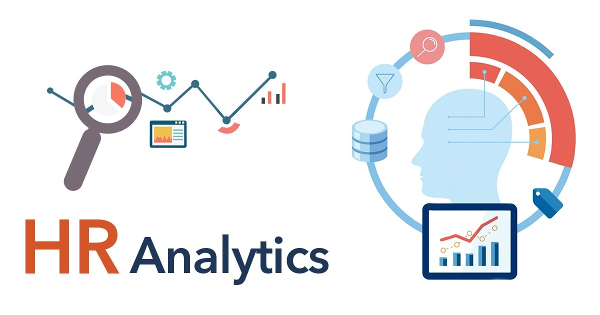

# HR_ANALYTICS

Key Focus: Analysing and understanding employee attrition rates and related factors.
Observations:
1. Attrition Rates by Departments: Highlighted disparities such as Research & Development with the highest average attrition rate (51.21%) and Hardware with the lowest (49.44%).
2. Employee Statistics: Explored total employees, average hourly rates based on roles, and attrition rates versus monthly income stats for different departments.
3. Attrition Rate vs. Monthly Income Stats: This KPI compares the attrition rate against monthly income statistics, likely exploring how income levels correlate with employee retention.
4. Attrition Rate vs. Year Since Last Promotion Relation:
This KPI explores the relationship between the attrition rate and the time elapsed since the last promotion for employees.

Analysis:
- Identified Challenges: Discovered issues like lower income, lack of work-life balance, unsatisfactory attrition rates, gender-based differences in hourly rates, and longer working hours.
Suggestions for Improvement:
- Income and Appraisals: Suggested increasing income with good appraisals to boost job satisfaction.
- Work-Life Balance: Emphasized the importance of ensuring a healthy work-life balance.
- Growth Opportunities: Advocated for providing growth opportunities to enhance retention.
- Equal Treatment: Recommended ensuring equality in hourly rates irrespective of gender.
Conclusion:
1) Attrition Rate Insights :
- Research Department has the highest attrition due to lower monthly income.
- Proposed solutions: Implement yearly appraisals to improve income satisfaction.
2) Skill Development Opportunities:
- Suggested on-job skill development programs to enhance employee performance.
3) Fair Compensation and Recognition:
- Advocated fair compensation and recognition for high performers to facilitate promotions and growth opportunities.
4) Employee Feedback and Work-Life Balance:
- Emphasized yearly employee feedback for better job satisfaction and work-life balance.
- Encouraged support and appreciation to boost employee motivation.
